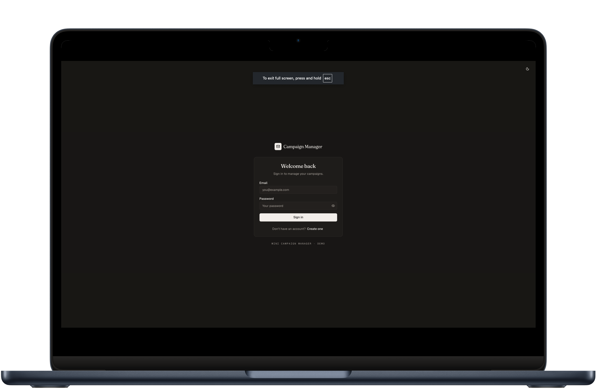
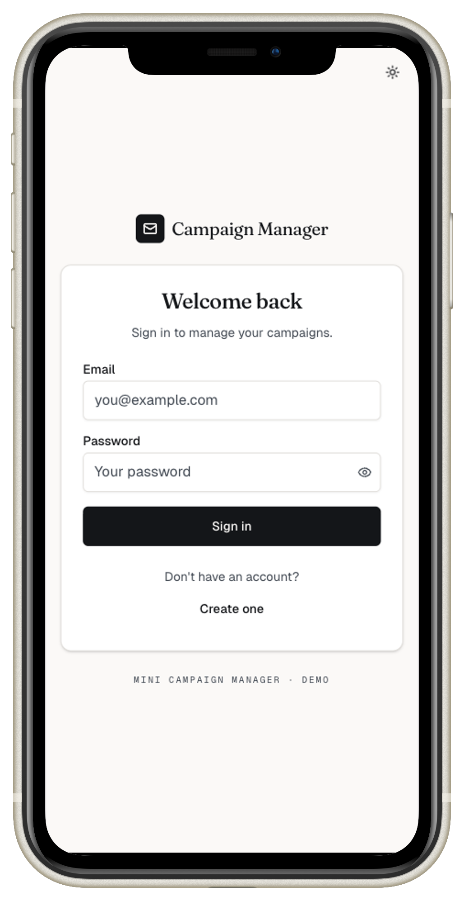
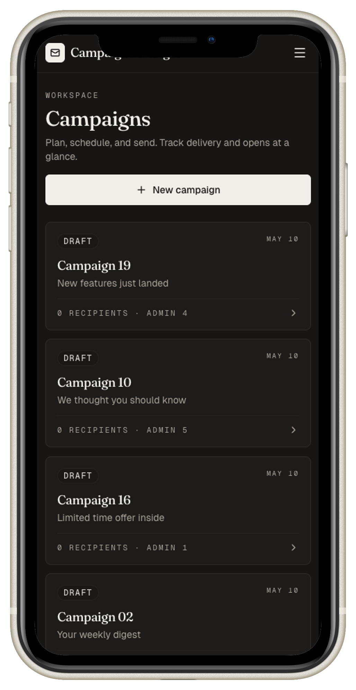
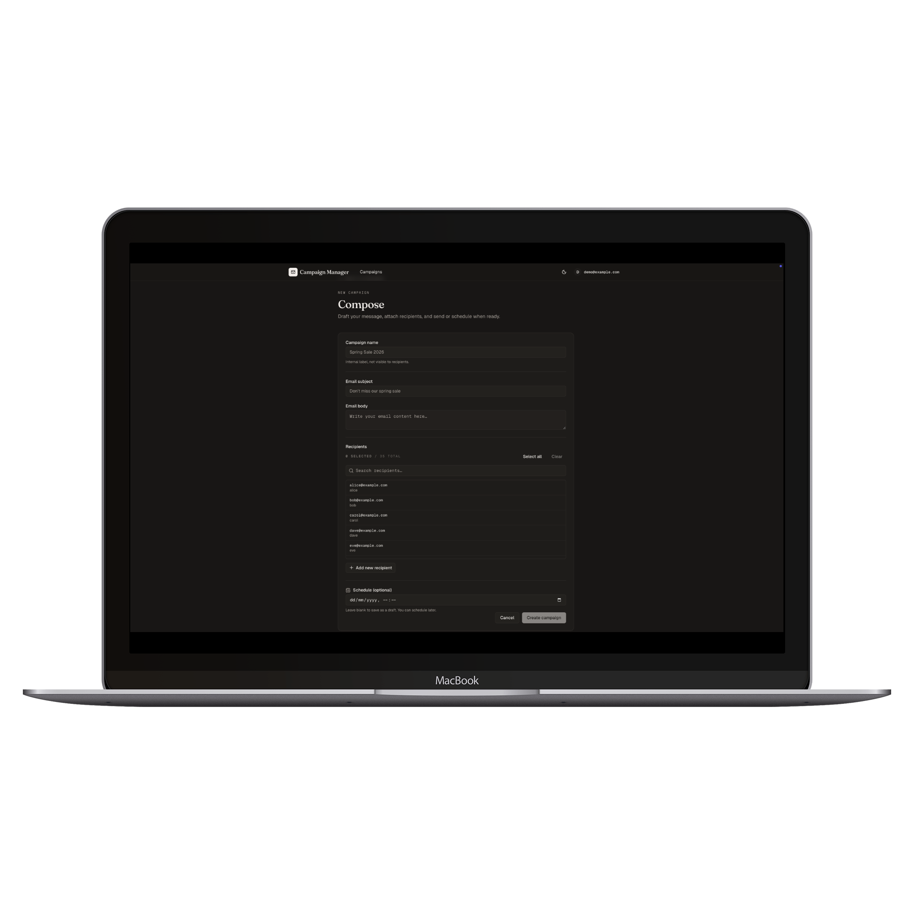
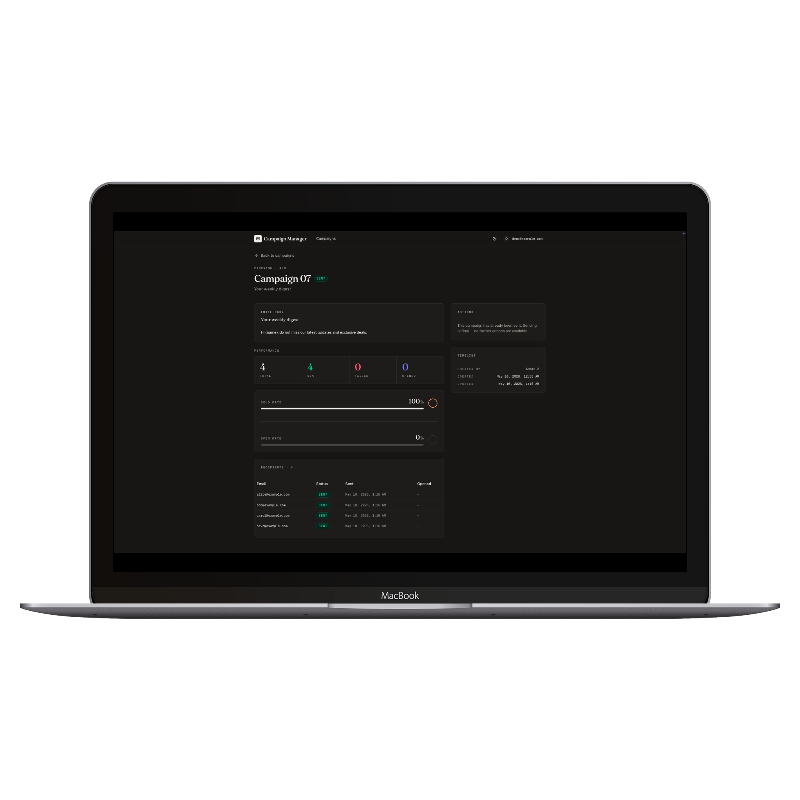
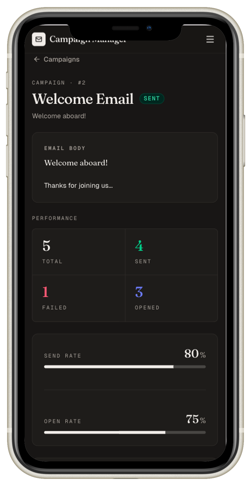
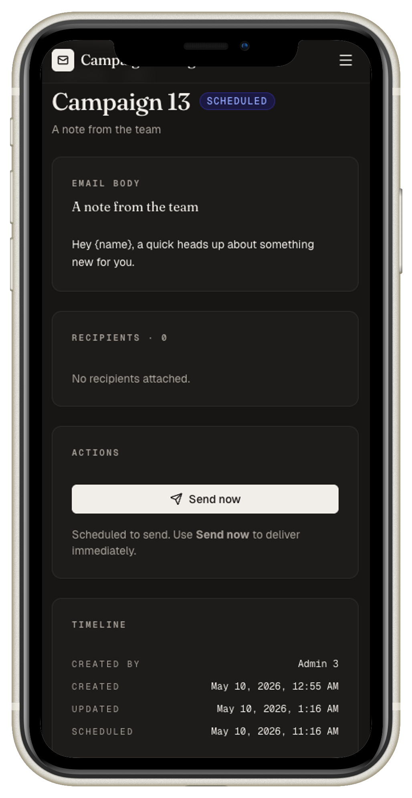

<p align="center">
  
  
  
  
  
  
</p>

<h1 align="center">Mini Campaign Manager</h1>

<p align="center">
  <i>A simplified MarTech tool for marketers to create, schedule, send, and track email campaigns — full-stack monorepo with a layered Express + Sequelize backend, React 19 + Vite frontend, and a one-command Docker setup.</i>
</p>

<br/>

## Screenshots

### Login

<p align="center">
  
  &nbsp;
  
  &nbsp;
  
</p>
<p align="center">
  <sub>Desktop · Light</sub>
  <sub>Desktop · Dark</sub>
  <sub>Mobile</sub>
</p>

### Campaign list

<p align="center">
  
  &nbsp;
  
  &nbsp;
  
</p>
<p align="center">
  <sub>Desktop · Light</sub>
  <sub>Desktop · Dark</sub>
  <sub>Mobile</sub>
</p>


### Create campaign

<p align="center">
  
  &nbsp;
  
</p>
<p align="center">
  <sub>Light</sub>
  <sub>Dark</sub>
</p>

---


### Campaign detail

<p align="center">
  
  &nbsp;
  
</p>
<p align="center">
  <sub>Desktop · Sent · Light</sub>
  <sub>Desktop · Sent · Dark</sub>
</p>
<p align="center">
  
  &nbsp;&nbsp;
  
</p>
<p align="center">
  <sub>Mobile · Sent</sub>
  <sub>Mobile · Scheduled</sub>
</p>

## Tech Stack

| Layer | Technology |
|---|---|
| **Monorepo** | Yarn Workspaces |
| **Backend** | Node.js 20 + Express + TypeScript (ESM) |
| **Database** | PostgreSQL 16 + Sequelize v6 (class-based models) |
| **Migrations** | sequelize-cli, forward-only, one table per file |
| **Auth** | JWT + bcryptjs (rounds 12, 12-char password floor, common-password blocklist) |
| **Validation** | Zod (request schemas, strict timezone on `scheduled_at`) |
| **Frontend** | React 19 + TypeScript + Vite |
| **Styling** | Tailwind CSS v4 (`@tailwindcss/vite`) + shadcn/ui |
| **State** | Redux Toolkit (auth slice) + TanStack React Query (server state) |
| **Testing** | Vitest + supertest (real Postgres, not mocks) |
| **DX** | ESLint flat-config (per-workspace) + Husky pre-push (lint + typecheck) |

---

## Getting Started

### Prerequisites

- Node.js 20+
- [Yarn](https://yarnpkg.com/) via corepack (`corepack enable`)
- Docker + Docker Compose

### Option 1 — Full stack in Docker (recommended)

```bash
cp .env.example .env          # set JWT_SECRET to any non-empty value
yarn setup                    # host checks + yarn install + docker compose up + migrate + seed
# Please visit http://localhost:5173
```

`yarn setup` wraps `scripts/setup.sh` and is idempotent — safe to re-run any time. Control commands:

| Command | What it does |
| --- | --- |
| `yarn start` / `yarn stop` | Bring the docker-compose stack up / down (postgres + backend + frontend). |
| `yarn logs` | Tail the stack. |
| `yarn db:reset` | Drop + recreate `campaign_manager`, migrate, seed. |
| `yarn clean` | Remove docker volumes (full reset). |

### Option 2 — Local Node for faster iteration

```bash
yarn stop                     # if the stack is up — frees :3001 / :5173
docker compose up -d postgres # just the DB
yarn migrate && yarn seed     # one-time
yarn dev:backend              # tsx watch on :3001 (separate terminal)
yarn dev:frontend             # vite on :5173, proxies API to :3001
```

### Running Tests

```bash
yarn test           # creates campaign_manager_test if missing, then runs vitest
yarn test auth      # forwards args to vitest (filter to auth.test.ts)
```

Wraps `scripts/test.sh`: ensures docker-compose postgres is up, creates the `campaign_manager_test` database if missing, then runs the backend suite with `DATABASE_URL` pointed at it. No local `createdb` / `psql` required.

### Lint, typecheck, git hooks

```bash
yarn lint         # both workspaces
yarn typecheck    # both workspaces
```

Added a Husky `pre-push` hook runs `yarn lint && yarn typecheck` before every push, activated automatically after `yarn install` (via the `prepare` script).

---

## Architecture

```
Request → cors → json → Route → auth → validate → Controller → Service → Model → Postgres
                                                                              ↘ errors → error-handler
```

---

## Business Rules

| # | Rule |
|---|------|
| 1 | A campaign can only be edited or deleted while `status === 'draft'` (`409 Conflict` otherwise) |
| 2 | `scheduled_at` must include an explicit timezone offset and resolve to a future timestamp (`422 Unprocessable Entity` otherwise) |
| 3 | Status transitions: `draft \| scheduled → sending → sent`. Send is one-way; once `sent`, no further changes |
| 4 | Multi-step writes (create campaign + attach recipients, send) are wrapped in a single transaction |
| 5 | Auth gates the entire `/campaigns` and `/recipients` surface; `password_hash` is never selected (covered by a regression test) |


---

## Database Schema

```
┌──────────┐       ┌──────────────┐       ┌──────────────────────┐       ┌──────────────┐
│  users   │       │  campaigns   │       │ campaign_recipients  │       │  recipients  │
├──────────┤       ├──────────────┤       ├──────────────────────┤       ├──────────────┤
│ id       │◄──┐   │ id           │◄──────│ campaign_id (PK)     │       │ id           │
│ email    │   └───│ created_by   │       │ recipient_id (PK) ───┼──────►│ email        │
│ name     │       │ name         │       │ sent_at              │       │ name         │
│ password_│       │ subject      │       │ opened_at            │       │ created_at   │
│   hash   │       │ body         │       │ status               │       └──────────────┘
│ created_ │       │ status       │       └──────────────────────┘
│   at     │       │ scheduled_at │
└──────────┘       │ created_at   │
                   │ updated_at   │
                   └──────────────┘

```

Indexes: unique on `users.email`, `recipients.email`; `campaigns.created_by`;
`campaigns.status`, `campaigns.scheduled_at`; composite PK on
`(campaign_id, recipient_id)`; `campaign_recipients.campaign_id`.

---

## How I developed with Claude Code Assistance

<blockquote>

This project was built with the assistance of <a href="https://docs.anthropic.com/en/docs/claude-code/overview">Claude Code</a>, Anthropic's agentic coding tool. Work shipped is logged in [`PLANS.md`](PLANS.md), grouped by area (Backend / Frontend / Infrastructure & Tooling) and commit references so the chain of work is auditable end-to-end. Below is a track record of what was delegated, what Claude Code did wrong, and what I retained as human responsibility during development.

</blockquote>

### Tasks I delegated to Claude Code 

1. **Boilerplate code generation** With requirements and instructions set in CLAUDE.md and supporting documents, Claude Code saved me efforts to generate boilerplate code and first version with basic schema design, API endpoints and Express Codebase. 
2. **Frontend Design and Component generation** Just like backend, Claude Code helped generated the first version with shadcn/ui primitives (buttons, cards, badges, inputs, dialogs), then React Query hooks, the Redux auth slice, and all page-level components with consistent patterns. I made use of Claude Code's official `frontend-design` plugins to improve visuals and applied consistent styling to project as well. 
3. **Project scaffolding.** With monorepo structure, Claude Code gave me templates for Docker Compose setup, ESLint + Prettier + Husky toolchain, and the layered backend skeleton with consistent pattern. However, the details and scope-related decisions are controlled by myself as human responsibility, whose details will be enclosed in next section. 
4. **Sequelize-cli migrations + seeders** At first iteration, even though Claude Code followed my instructions to use Sequelize instead of `pg` driver, it only applied to backend's service layer. Data seeders are written in a single SQL script. To avoid manual labor, I delegated to Claude Code to generate migration and seeders script with Sequelize-cli and use seeders, but with human verification at the end. 
5. **Automated progress tracking and context organization** I set up a hook for Claude Code so that after each time an implementation plan finished executing, it will summarize the progress and save in `/plans` folder. However, for audit's clarity, I removed past plans from repository and keep progress logs in `PLANS.md` instead.  
6. **Failed to read from process.env** After migration, Claude Code made an Express.js common mistake to assign variables with values read directly from `process.env`, I had to debug and imported `dotenv`. 


### Actual prompts I used 

1. > /frontend-design:frontend-design the dark mode background is pure black and may cause eye strain, suggest a color theme for dark mode that follow yc-startup standard and WCAG 2.2 accessibility best practices 

   The first implementation of dark theme was as-token-inversion, and manual verification found visually unease. Therefore, I utilized Claude Code's official plugins to make dark mode follow WCAG 2.2 accessibility standard, by which Claude suggested color options for me to pick and applied on my project seamlessly. 

2. >  /eng-review Current backend authentication middleware is missing rate limiting, and JWT secret is not in use in development environment. Implement express-rate-limiter for endpoints that requires authentiation and require JWT secret for development, only except for test. 
   
   Made use of `gstack`'s Engineer Review command for comprehensive check on then current missing authentication best practices, which also helped me devise a plan to add missing rate limit, JWT handling and added JWT secrets to compose file as well. Other suggestions was rejected with consideration to demo-scale project, for example, CORS addition. Then, plan is saved in `/plans`folder as markdown file, context is cleared to avoid hallucination. Markdown file of plan is then used as context mentioned in next `/execute-plan` customm command, whose progress is controlled by manual reviews & approval. 
   
3. > Requests parameters in @backend/src/controllers/ are poorly structured, for example `Request<P, ResBody, ReqBody, ReqQuery>`. Drop these generic clutters from controller and use standard Express's Request interface instead.  
   
   After backend layer migration, request signatures were `Request<{}, CampaignDTO, CreateCampaignBody>` - including six type parameters, three of them `{}` and lots of `unknown`, repeated for every endpoint. This made code extremely hard to read. I had to instruct Claude to remove verbose signatures by letting the validate middleware narrow `req` and dropping the unused generics. 

### Where Claude Code Was Wrong / Needed Correction 

1. **Poorly structured backend at first attempts** Even though the first version of backend could run, the codebase was poorly structured: service logics, query builders and status handling are placed in `src/routes/*` files. This made codebase large and hard to read. I had to migrate backend to standard `controller, service, router` layers, which allows clearer project structure and ease to debugging. 
2. **NOT-NULL tightening would block existing rows.** First draft didn't have a backfill step before the constraint added, which would have failed on any DB with existing nulls.
3. **Hardcoded `localhost:3001` in the Vite dev proxy** After scaffolding project and tested project suite inside containers, every frontend request died with `ECONNREFUSED`. Root cause was that the frontend container resolves to itself. After debugging, assiogn the proxy target from `process.env.VITE_PROXY_TARGET`, defaulting to `http://localhost:3001`. 
4. **Fabricated authorization rules for campaigns** At later stages of development, Claude fabricated strict `created_by` constraints to every campaign actions and added filter to queries, on premises that one user can only view and perform actions to projects created by themselves. Considering scope of this demos and lack of mentions in Requirements, I had to adjust the scope and guided Claude to remove such restrictions. 

### What I Chose to Retain as Human Responsibility

- **Technical: Architecture Designs** For each migrations related to architectural patterns and database schema design, I manually approve and control key decisions including: indexing, foreign key constraints, cascade rules, authentication flows, validation rules, handling password hashes. 
- **Development: Scope controls** For large feature enhancements or migrations, I did not start with a single prompt, but made use of `humanlayer` commands to gather context, answer decisive questions regarding depth and scope of the enhancements, which prevents Claude from over-engineering or fabricating out-of-scope rules. Claude Code plan also suggested extensive enhancements, but final decisions whether to implement, and how implementation is planned is controlled by human engineer.  
- **Security: Secret handling and infrastructural configurations** Manual verifications are enforced on JWT secret handling, password hashes, auth middleware and infrastructural configurations. Only after manual verifications did I discovered limits of Claude and enforced stricter security practice, for example, password validation did not work at first version. 
- **Business: Manage bussiness rules** When Claude suggested enabling edits for `scheduled` campaigns, I reviewed the business rules and rejected as it would break the `campaign can only be edited or deleted when status is `draft`` business constraints. 
- **Testing: Design and keep meaningful tests only** For this project, I used Vitest tests on backend layer only, and test selection are verified manually. Claude Code tends to generate lots of tests in a single files with redundants. Therefore, I had to manage organization of the test files for separation of concerns and made decisions to keep meaningful tests only. 
    
---

<p align="center">
  <sub>MIT — built as a take-home assigment.</sub>
</p>
